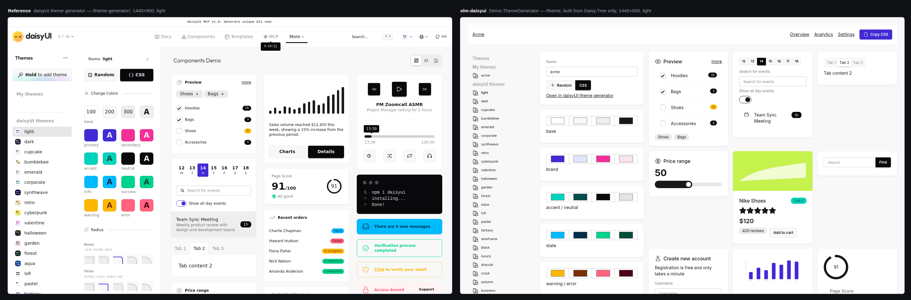
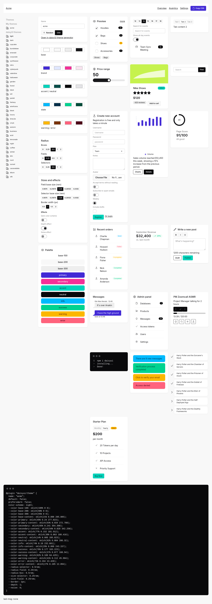

# elm-daisyui

A typed, closed composition layer over [daisyUI](https://daisyui.com) 5 for Elm 0.19.1.

You do not write HTML or class strings. You build a value of type `Daisy.Tree.Page` and hand it to
`Daisy.Render.page`. daisyUI's CSS is used unchanged; `Daisy.Render` is the only module in the
package that emits a class attribute.

- Live demos: <https://alexbruf.github.io/elm-daisyui/>
- Documentation site: <https://alexbruf.github.io/elm-daisyui/docs/> (this README and every other
  document in the repository, rendered)
- API docs: <https://package.elm-lang.org/packages/alexbruf/elm-daisyui/latest/>

## The four guarantees

The compiler and the test suite together guarantee:

1. **No contradictory modifiers on one element.** `btn-sm` and `btn-lg`, or two colours, cannot
   both be set: each exclusive class group of a component is one `Maybe` field of a generated
   type, so there is nowhere to put the second value.
2. **No invalid nesting.** A card inside a card, a section inside a block, a `card-body` outside a
   `Card` — none of them is a value the constructors can build.
3. **No visual overlap.** Modal, drawer, toast, dropdown and tooltip are not nodes you place.
   Overlays live only in `Page.overlays` and are rendered by `Daisy.Render` into one fixed layer in
   a fixed order (drawer, modal, toast); dropdown and tooltip are fields on a leaf's config.
4. **A page content budget.** `Sections` has constructors for one to five sections and no others,
   and `Page.cta` is a mandatory single field, so "six sections" and "zero or two primary CTAs" are
   type errors rather than runtime checks.

There is no `Raw Html` constructor. Custom markup has exactly one door — [`Leaf.Embed`](#custom-views),
which is a *framed* one: the renderer draws it in a fixed, clipped, labelled box, hands it the theme's
colours as CSS variables, and forbids it a class attribute. Markup the tree cannot express is still
recorded in [`fixtures/rejected.md`](fixtures/rejected.md) with a reason; an embed is for a drawing
daisyUI has no component for, not for hand-writing markup a `Block` or `Leaf` should express.

## Install

```
elm install alexbruf/elm-daisyui
```

The package depends on `elm/html`, `elm/json`, `elm/svg`, `terezka/elm-charts`,
`justinmimbs/date` and `alexbruf/elm-cally`. You still need daisyUI's CSS in your build — see
[CSS setup](#css-setup).

## The model

A page is four levels deep and each level may only hold the level below it. `Page` carries a
`Shell` (`Plain`, or `Dashboard` with a sidebar menu and a navbar), a `Sections` value holding one
to five `Section`s (`Hero`, `Navbar`, `Footer`, `Grid`, `Stack`), a mandatory `cta` — the page's
only primary button, which the renderer places according to the shell — a list of `Overlay`s, and a
`Theme`. A `Section` holds `Block`s (`Card`, `Stat`, `Table`, `Form`, `Chart`, `Alert`, `Prose`,
`Menu`, `Steps`, `Timeline` and the rest of daisyUI's block-level components); a `Block` holds
`Leaf`s (`Button`, `Badge`, `Input`, `Select`, `Toggle`, `Calendar`, `Text`, `Heading`, `Icon`, …),
which hold only data. `Overlay` (`Modal`, `Drawer`, `Toast`) exists only as an element of
`Page.overlays`, never as a child of anything else, and a `Leaf.Button` cannot take the `Primary`
colour because `Page.cta` owns it. Where a daisyUI component has `part` classes the tree takes a
record of parts (`CardParts`, `NavbarParts`, `CollapseParts`, …) rather than free children, so a
part can neither appear outside its component nor twice.

## A complete example

`Browser.sandbox`, one section, one card, one badge, one CTA:

```elm
module Main exposing (main)

import Browser
import Daisy.Render
import Daisy.Schema.Badge as Badge
import Daisy.Tree exposing (..)
import Html exposing (Html)


type alias Model =
    { clicks : Int }


type Msg
    = Clicked


main : Program () Model Msg
main =
    Browser.sandbox { init = { clicks = 0 }, update = update, view = view }


update : Msg -> Model -> Model
update Clicked model =
    { model | clicks = model.clicks + 1 }


view : Model -> Html Msg
view model =
    let
        card =
            { emptyCardParts
                | title = Just "Clicks so far"
                , body = [ CardLeaf (Badge { defaultBadgeConfig | color = Just Badge.Secondary } (String.fromInt model.clicks)) ]
            }
    in
    Daisy.Render.page
        (Page
            { header = Just (pageHeader "Clicker")
            , shell = Plain
            , sections =
                Sections1
                    (Stack defaultStackConfig [ Card defaultCardConfig card ])
            , cta = cta "Click me" Clicked
            , overlays = []
            , theme = Dark
            , dock = Nothing
            , fab = Nothing
            }
        )
```

`Daisy.Render.page` returns `Html msg`, so it fits `Browser.sandbox`, `Browser.element` and
`Browser.document` alike. It writes `data-theme` on the page root itself, which is what switches
the daisyUI theme.

`header` is the page's title bar — a title, an optional `breadcrumbs` trail and optional
right-hand controls — rendered by the shell above the sections. It is chrome, not content, so it
costs none of the five-section budget and it lands in the same place under `Plain` and under
`Dashboard`. Pass `Nothing` for a page that does not want one.

## Configs

Every component with class groups has an `XConfig` record and a `defaultXConfig` value. There is no
`String` class field anywhere:

- one `Maybe <Group>` field per **exclusive** group (`color`, `style`, `size`, `direction`,
  `placement`, `variant`), whose type comes from the generated module for that component —
  `Daisy.Schema.Button.Color`, `Daisy.Schema.Card.Size`, `Daisy.Schema.Input.Color`, …
- `modifiers : List <Component>.Modifier` (and `behaviors` where the component has a `behavior`
  group) for the groups that are genuinely sets.

So a config is built by updating the default:

```elm
import Daisy.Schema.Button as Button

saveButton : Leaf Msg
saveButton =
    Button
        { defaultButtonConfig
            | color = Just Secondary
            , size = Just Button.Sm
            , modifiers = [ Button.Wide ]
            , onClick = Just Save
        }
        "Save"
```

`size` and `modifiers` take the generated `Daisy.Schema.Button` types, but `color` takes
`Daisy.Tree.ButtonColor`, which is the same list of colours **without** `Primary`: the primary
button is `Page.cta` and nothing else can become one.

The `Daisy.Schema.*` modules are generated from daisyUI's own docs frontmatter by
`tools/gen-schema.js`; each exposes its types, a `<group>ToClass` function, `component`,
`componentClasses`, `parts` and an `all<Group>` list. `Daisy.Schema` aggregates them
(`allClasses`, `exclusiveGroups`, `parts`, `componentClasses`) and is what the test suite checks
the renderer against.

Per-item state lives on the item, not the container: `menu-active` is a `Bool` on a `MenuItem`,
`tab-active` on a `Tab`, `step-*` colours on a `Step`.

## Icons

`Daisy.Icon` is a closed set of 25 drawings — heroicons 2.2.0 outline, MIT, (c) Tailwind Labs —
copied into the package at build time. It is pure data: the path data lives in an internal module
that is not exposed, so nothing a caller writes can become markup. An icon is not a daisyUI
component and emits no daisyUI class, exactly like `Leaf.Heading` and `Leaf.Image`; only its size
class (`size-4` / `size-5` / `size-6`) comes from `Daisy.Render.tokens`.

```elm
import Daisy.Icon as Icon
import Daisy.Tree exposing (..)
```

Accessibility is a field, not a convention. `label = Nothing` renders the `<svg>` `aria-hidden`,
which is what you want beside a text label; `Just` renders an image `role` plus that `aria-label`,
which is what names an icon-only control:

```elm
-- decorative, next to its own text
Icon defaultIconConfig Icon.Home

-- a stat-figure, at the largest of the three sizes
Icon { defaultIconConfig | size = IconLg } Icon.CurrencyDollar

-- an icon-only button: `ariaLabel` names the button, the glyph stays hidden
Button
    { defaultButtonConfig
        | icon = Just Icon.Eye
        , ariaLabel = Just "View order"
        , style = Just SButton.Ghost
        , modifiers = [ SButton.Square ]
    }
    ""
```

The icon fields are all `Maybe` with a `Nothing` default: `ButtonConfig.icon` and `Cta.icon`
(a leading glyph), and `StatItem.figure`, which takes any `Leaf` and therefore takes `Leaf.Icon` as
it stands. A menu row's leading glyph is `MenuItem.glyph : Maybe MenuGlyph`, a closed pair — an
icon, or the four-colour tile of a theme:

```elm
MenuItem { base | glyph = Just (MenuIcon Icon.Home) }

-- a theme-picker row, painted from that theme's own colours
MenuItem { base | glyph = Just (MenuThemeDots Nord) }
```

Import `Daisy.Icon` **qualified**. Three of its constructors (`Calendar`, `Menu`, `Check`) also name
a `Daisy.Tree` constructor, so `exposing (..)` on both at once is ambiguous.

## Charts

`Daisy.Chart` is a closed configuration over `terezka/elm-charts`. No elm-charts type appears in its
API, so chart code cannot reach the underlying library:

```elm
import Daisy.Chart as Chart

revenueCard : Block msg
revenueCard =
    Card defaultCardConfig
        { emptyCardParts
            | title = Just "Net revenue vs. operating cost"
            , body =
                [ CardChart (Chart.Line Chart.defaultLineStyle)
                    { xLabels = [ "Jan", "Feb", "Mar" ]
                    , series =
                        [ Chart.series "Revenue" Chart.Primary [ 182, 201, 226 ]
                        , Chart.series "Cost" Chart.Neutral [ 120, 128, 131 ]
                        ]
                    }
                    Nothing
                ]
        }
```

`ChartConfig` is `Line LineStyle | Bar BarStyle | Area | Donut`, where `LineStyle` is
`{ stepped : Bool }` and `BarStyle` is `{ stacked, track, rounded : Bool }` — three independent
switches, so a record rather than eight constructors. `allChartConfigs` is still the exhaustive
list of all twelve values. A `Series` also carries `dashed : Bool`, which is the convention for a
projection; `Chart.series` builds the solid case.

Series colours are the daisyUI semantic palette (`Primary … Neutral`), emitted as
`var(--color-primary)` and friends, so charts re-colour with the theme without the renderer knowing
any concrete colour. The **track** behind a bar and the **band** behind a hovered column are
`var(--color-base-200)` and `var(--color-base-300)`; they are module constants
(`Chart.trackColorToCss`, `Chart.bandColorToCss`) rather than `SemanticColor` values, so a *series*
can never be painted the colour of the panel it is drawn on. Chart height is fixed per block size
token; there is no per-call override.

### Hovering

The third argument of `Block.Chart` / `CardChild.CardChart` is an optional interaction:

```elm
type alias ChartInteraction msg =
    { hovered : Maybe Int          -- index into ChartData.xLabels
    , onHover : Maybe Int -> msg
    }
```

The state is an **x index**, not an elm-charts item, so the application stores an `Int`. Given one,
the renderer highlights the hovered column and draws a tooltip card listing every series' colour
dot, name and value at that x. It fires on pointer move, on click (a touch produces no
`mousemove`) and with `Nothing` on leave.

A hover message arrives on every mouse move, so treat it the way this repository's demo router
does — apply it to the model, and leave it out of anything that records "the last thing the user
did".

### Motion

Charts animate in: bars grow out of the baseline, lines draw themselves. The rules live in
`Daisy.Css.stylesheet` — an Elm value, because the Elm registry publishes `src/` and nothing else,
so a `.css` file in a package never reaches you. Write it to a real stylesheet and import it (see
[CSS setup](#css-setup)); without it a chart simply has no animation rather than a broken one.

Everything in it is inside `@media (prefers-reduced-motion: no-preference)`, so a reader who has
asked for less motion gets the undecorated page. The drawing is keyed by its data, so replacing a
dataset replays the animation and hovering does not.

## Custom views

Sometimes the drawing you need is not one of the five chart kinds and is not a daisyUI component
either. `Leaf.Embed` is the one way your own `Html` reaches a page, and everything about it is
the renderer's except what you draw:

```elm
import Daisy.Tree exposing (..)
import Viz.Funnel

funnelCard : Block msg
funnelCard =
    Card defaultCardConfig
        { emptyCardParts
            | title = Just "Conversion funnel"
            , body = [ CardLeaf (Embed (embedConfig "Conversion funnel") Viz.Funnel.view) ]
        }
```

`Daisy.Render` wraps the result in `relative overflow-hidden w-full` at one of three fixed heights
(`EmbedSm` 160px, `EmbedMd` 256px, `EmbedLg` 384px — `EmbedMd` is the height a `Block.Chart` gets,
so the two sit level side by side), with `role="figure"` and the config's `label` as `aria-label`.
So an embed cannot overlap the block below it, cannot escape its box, and cannot go unnamed. It is a
`Leaf`, so it cannot hold — or stand in for — a block, a section or an overlay.

Your view function is called with a `ThemeContext`, which is the whole palette an embed gets:

```elm
view : ThemeContext -> Html msg
view ctx =
    Svg.svg [ SvgA.viewBox "0 0 640 240" ]
        [ Svg.rect [ SvgA.fill (ctx.surface Base200), {- ... -} ] []
        , Path.element band [ SvgA.fill (ctx.color Primary) ]
        , Svg.text_ [ SvgA.fill (ctx.surface BaseContent) ] [ Svg.text "Visitors" ]
        ]
```

| Field | Value |
|---|---|
| `color : SemanticColor -> String` | `"var(--color-primary)"`, `"var(--color-accent)"`, … — the same eight the charts use |
| `surface : Surface -> String` | `Base100`, `Base200`, `Base300`, `BaseContent` as `var(--color-base-*)` |
| `theme : Theme` | the page's theme, for a drawing that must branch on light and dark rather than on a variable |
| `radiusBox : String` | `"var(--radius-box)"`, so a rounded shape matches the card around it |

They are CSS variables, not colour values, so the drawing follows the active theme with no
re-render and no message — the same way a chart series does.

**An embed may not carry a class.** `NoClassOutsideRender` reports `Html.Attributes.class` inside
one exactly as it does anywhere outside `Daisy.Render`, and `NoRawSchemaStrings` reports a daisyUI
class written as a literal. Style an embed with inline `style`, SVG presentation attributes and the
`ThemeContext` colours. In this repo's demo the exemption that lets an embed import `Html`/`Svg` at
all is a single directory, `demo/src/Viz/`; the demo pages themselves still cannot.

**What you give up** is class coverage. `CoverageTest`, the corpus and `tools/render-class-audit.js`
read classes back off rendered markup, and an embed emits none, so nothing inside one is checked by
them. Overlap, overflow, contrast, accessibility and the theme sweeps are unaffected: they measure
the painted page. `demo/src/Viz/Funnel.elm` is the worked example — a conversion funnel drawn with
`gampleman/elm-visualization`, whose bands are asserted to equal the theme's own `--color-primary`,
`--color-secondary` and `--color-accent` in every theme.

## Calendar

`Leaf.Calendar` renders a date picker through [`alexbruf/elm-cally`](https://package.elm-lang.org/packages/alexbruf/elm-cally/latest/),
a pure-Elm port of the Cally web component: same markup and `part` attributes, light DOM, no ports
and no custom elements. elm-cally's own `Config` is built inside `Daisy.Render` and never exposed,
the same rule `Daisy.Chart` follows for elm-charts.

The picker has state, so it lives in your model and takes three functions from the package:

```elm
init : ( Model, Cmd Msg )
init =
    ( { calendar = Daisy.Render.initCalendarRange calendarConfig Nothing }, Cmd.none )


update : Msg -> Model -> ( Model, Cmd Msg )
update msg model =
    case msg of
        CalendarMsg sub ->
            Daisy.Render.updateCalendar calendarConfig sub model.calendar
                |> Tuple.mapFirst (\state -> { model | calendar = state })

        RangePicked value ->
            ( { model | calendar = Tree.setCalendarValue value model.calendar }, Cmd.none )
```

`initCalendarDate`, `initCalendarRange` and `initCalendarMulti` build the three kinds of state;
`CalendarConfig` carries `today`, `toMsg` (for `CalendarMsg`) and `onChange` (for the picked
value). `updateCalendar` returns a `Cmd` because the roving `tabindex` needs `Browser.Dom.focus`.

The picker needs two stylesheets that are not part of daisyUI: elm-cally's own base stylesheet, and
daisyUI's `.cally` block with `::part(x)` rewritten to `[part~="x"]` (elm-cally has no shadow DOM,
so `::part` never matches). `bun tools/gen-cally-css.js` writes both from
`Cally.Css.stylesheet` in the installed elm-cally package; the generated pair is committed here as
[`demo/cally-base.css`](demo/cally-base.css) and [`demo/cally-daisy.css`](demo/cally-daisy.css) and
can be copied as-is. Import them after the daisyUI plugin line so its layers are already registered.

## Themes

`Page.theme` is a `Daisy.Tree.Theme`: either one of the thirty-five daisyUI ships, or a `Custom`
one of your own.

```elm
Page { ... , theme = Nord }
```

A custom theme is the same twenty-nine declarations daisyUI's own theme format has, and nothing
else — twenty `oklch()` colours, three radii, two base sizes, a border width and the two effect
switches. Every field is a closed type, so a theme cannot say something daisyUI cannot express:

```elm
import Daisy.Themes as Themes
import Daisy.Tree as Tree exposing (Border(..), Radius(..), Size(..), Theme(..))


brand : Maybe Theme
brand =
    Tree.themeName "acme"
        |> Maybe.map
            (\name ->
                Custom
                    { Themes.nord
                        | name = name
                        , colors = ...
                        , radius = { selector = RadiusXs, field = RadiusXs, box = RadiusSm }
                        , border = BorderThin
                        , depth = False
                    }
            )
```

- **`ThemeName` is opaque.** `Tree.themeName : String -> Maybe ThemeName` is the only way to make
  one; it accepts `[a-z][a-z0-9-]*` and refuses all thirty-five reserved daisyUI names, so a theme
  that would collide with a stylesheet daisyUI already ships is unrepresentable.
- **`Daisy.Themes` is every built-in as an editable value.** `Themes.nord`, `Themes.light`, … plus
  `builtinToCustom : Theme -> Maybe CustomTheme`, generated from daisyUI's own sources by
  `bun tools/gen-themes.js`. It is what makes "start from a built-in" one record update.
- **`Radius`, `Size` and `Border` are closed enums**, matching the five/five/four steps daisyUI's
  own theme generator offers. `depth` and `noise` are `Bool`s: daisyUI's CSS only ever multiplies
  them inside a `calc()`, and its own themes only ever write `0` or `1`.
- **Colours are `Daisy.Color.Oklch`** — `{ l, c, h }`, with `l` in **percent** (0..100), the unit
  daisyUI prints. `Daisy.Color.hexToOklch` / `oklchToHex` convert to and from the `#rrggbb` an HTML
  colour input produces, which is what a theme editor needs.

**No stylesheet registration is needed.** `Daisy.Render.page` writes `data-theme="<name>"` and, for
a `Custom` theme, the twenty-nine declarations as inline CSS custom properties on the same element.
daisyUI never reads those variables where they are *defined* — every use in its component CSS is a
`var(--color-primary)` or a `calc(var(--depth) * 30%)` on the component itself, and none of them is
registered with `@property { inherits: false }` — so an inline definition on an ancestor themes the
whole subtree exactly as a `[data-theme]` rule would, `--depth` and `--noise` included.

If you do want a stylesheet — for a page daisyUI has to style before Elm boots, say —
`Tree.customThemeToCss` prints the block daisyUI's docs ask for:

```css
@plugin "daisyui/theme" {
  name: "acme";
  default: false;
  prefersdark: false;
  color-scheme: light;
  --color-base-100: oklch(98% 0 0);
  /* ...27 more... */
}
```

`Tree.customThemeToJson` prints the same theme in the shape daisyUI's own
[theme generator](https://daisyui.com/theme-generator/) round-trips through its URL, so a theme
built here can be handed back to that tool.

## CSS setup

Tailwind 4 plus the daisyUI plugin, and then one thing that is specific to Elm.

Elm compilers used with Vite (`vite-plugin-elm`) compile in memory and write no `.elm.js` file, so
Tailwind's scanner has no build artifact to read class names out of. Point `@source` at the Elm
**source files** that hold the class-name literals instead — Tailwind 4's scanner is
extension-agnostic and finds `btn-primary` inside an Elm string literal as readily as inside HTML.
Two files (plus one directory) are enough, because they are the only places a daisyUI class string
exists: `Daisy/Render.elm` and the generated `Daisy/Schema*`.

`demo/app.css` in this repository does exactly that, with paths relative to the checkout:

```css
@import "tailwindcss";
@plugin "daisyui" {
  themes: all;
}

@source "../src/Daisy/Render.elm";
@source "../src/Daisy/Schema";
@source "../src/Daisy/Schema.elm";
@source "./src";
```

As a consumer the package is not in your repository, it is in the Elm package cache, so point at it
there — `@source` takes a path relative to the CSS file, and does not expand `~`, so use a real
path:

```css
@source "/home/you/.elm/0.19.1/packages/alexbruf/elm-daisyui/1.0.0/src/Daisy/Render.elm";
@source "/home/you/.elm/0.19.1/packages/alexbruf/elm-daisyui/1.0.0/src/Daisy/Schema";
@source "/home/you/.elm/0.19.1/packages/alexbruf/elm-daisyui/1.0.0/src/Daisy/Schema.elm";
@source "./src";
```

`elm-stuff/` holds compiled artifacts, not the package's sources, so it is not a substitute. If a
machine-independent path matters more than the extra files, copy `src/Daisy/Render.elm` and
`src/Daisy/Schema*` into a vendored directory in your repository and `@source` that — the check
that matters either way is that every class in `Daisy.Schema.allClasses` survives into your built
CSS (`bun tools/css-coverage.js` is that check here).

If you use `Leaf.Calendar`, add the two calendar stylesheets after the plugin line:

```css
@import "./cally-base.css";
@import "./cally-daisy.css";
```

If you want the chart animations, write `Daisy.Css.stylesheet` to a file and import that too. This
repository generates `demo/daisy-motion.css` from it with `bun tools/gen-daisy-css.js`
(`tools/ci.sh` regenerates and diffs it, so a hand-edit is a red pipeline); any equivalent step
does. The four class names it defines are `daisy-`-prefixed so nothing daisyUI or Tailwind ships
can collide with them, and they are listed in `Daisy.Render.tokens` like every other class the
renderer emits.

```css
@import "./daisy-motion.css";
```

## Demos

Four demo applications, each a single `Page` value, built only through the tree. They share one
router (`demo/src/Main.elm`) and are live at <https://alexbruf.github.io/elm-daisyui/>. The
dashboard sidebars also link to the documentation site at `/docs/`, which `tools/build-docs-site.js`
generates from the repository's markdown as part of the demo build.

The Admin demo is a deliberate recreation of daisyUI's own **Nexus** e-commerce dashboard
(<https://nexus.daisyui.com/dashboards/ecommerce>) — reference on the left, the tree's output on
the right, both at 1440x900:


Everything on the right comes out of `Daisy.Tree`: no `Html.Attributes.class`, no raw markup, every
class either a `Daisy.Schema.*` value or one of `Daisy.Render`'s 100 layout tokens — including the
7:5 twelve-column splits, the stacked bars on their `base-200` track with rounded caps and a hover
tooltip, the stepped acquisition line with its dashed projection, the tinted active sidebar row and
the 1px `base-300` edges under the navbar and down the sidebar. `docs/tree-decisions.md` ("Nexus
design pass" and "Charts and fidelity") lists what was added to the tree to get there, and the
residuals table there says how each remaining difference was closed — or, for the two that were
not, why.

**[The dashboard shell](demo/src/Demo/Admin.elm)** — `Shell.Dashboard` is a daisyUI `drawer` open
from `lg:` up. It carries the whole sidebar panel (brand row, menu, footer chip) plus the navbar:

```elm
dashboard : Config msg -> DashboardShell msg
dashboard config =
    { brand = Just { icon = Icon.ChartBar, name = "Acme" }
    , sidebar = sidebar config
    , sidebarFooter = Just (UserChip { defaultUserChipConfig | boxed = True } denish)
    , navbar = navbar config
    , edges = True
    }
```

`menu-title` rows label the groups and a `MenuItem.badge` is the soft pill on a new entry:

```elm
sidebar : Config msg -> MenuSpec msg
sidebar config =
    { config = Tree.defaultMenuConfig
    , items =
        [ sectionTitle "Dashboards"
        , navItem "Overview" Icon.Home (href config "/") (config.onNavigate "/") True Nothing
        , navItem "Analytics" Icon.ChartBar (href config "/analytics") (config.onNavigate "/analytics") False (Just "New")
        , sectionTitle "Workspace"
        , navItem "Settings" Icon.Cog (href config "/settings") (config.onNavigate "/settings") False Nothing
        , docsItem config
        ]
    }
```

**Metric tiles** — one `Stat` block per tile in a four-column `Grid`. `trend` is the delta badge
that shares the number's baseline; `Daisy.Render` paints the shaded tile around the `stat-figure`:

```elm
metricsSection : Section msg
metricsSection =
    Grid { columns = Tree.Cols4 }
        [ metric Icon.CurrencyDollar "Revenue" "$587.54" (up "10.8%") "vs. $494.16 last period"
        , metric Icon.ShoppingCart "Sales" "4,500" (up "21.2%") "vs. 3,845 last period"
        , metric Icon.Users "Customers" "2,242" (down "6.8%") "vs. 2,448 last period"
        , metric Icon.Pencil "Spending" "$112.54" (up "8.5%") "vs. $98.14 last period"
        ]


metric : Icon.Icon -> String -> String -> Leaf msg -> String -> Block msg
metric icon title value trend desc =
    let
        base : StatItem msg
        base =
            Tree.emptyStatItem title value
    in
    Stat Tree.defaultStatConfig
        [ { base | trend = Just trend, desc = Just desc, figure = Just (Icon defaultIcon icon) } ]
```

**A card with a header row** — glyph and title on the left, a `tabs tabs-box tabs-xs` segmented
control and any leaves on the right. A `Tab` with empty `content` owns no panel, which is what
makes `tabs-box` usable as a control; its `onClick` is what makes it change something outside the
strip:

```elm
Card { Tree.defaultCardConfig | padding = Tree.PaddingDashboard }
    { emptyCardParts
        | title = Just "Revenue Statistics"
        , headerTabs = Just { config = segmentedConfig, tabs = periodTabs config }
        , body =
            [ CardStat Tree.defaultStatConfig
                [ headline "Total income" (revenueTotal config.chartRange) (up "3.24%") caption ]
            , CardChart
                (DChart.Bar { stacked = True, track = True, rounded = True })
                (revenueSeries config.chartRange)
                (Just { hovered = config.hoveredBar, onHover = config.onChartHover })
            ]
    }
```

**A twelve-column band** — the chart row is Nexus's own 7:5 split. `Section.Grid` takes a closed
`GridSection`: `Columns` for equal tracks, `Spans` for the twelve, where every cell states its
width. A span in an equal grid is a type error, not a convention:

```elm
Grid
    (Tree.Spans
        [ Tree.span Tree.Span7 (revenueCard config)
        , Tree.span Tree.Span5 (acquisitionCard config)
        ]
    )
```

A cell holds a *list* of blocks (`spanColumn`) — a column of panels — and may lay them out as a grid
of its own (`spanGrid Span7 CellThree cards`), which is what a page with a rail beside a masonry of
preview cards needs. It is a property of the cell, not a nesting level: the children are still
blocks, and a block still never contains a block.

**The orders table** — a `Checkbox` column, a squircle thumbnail beside the product name, soft
status badges and two icon-only row actions. A `TableCell` is `{ leading : Maybe (Leaf msg),
content : Leaf msg }`, so a cell can hold a pair without a container node:

```elm
orderRow : Config msg -> Order -> Row msg
orderRow config order =
    { header = False
    , cells =
        [ Tree.tableCell (Checkbox { defaultCheckbox | size = Just SCheckbox.Sm })
        , { leading = Just (thumbnail order.swatch), content = Text order.product }
        , Tree.tableCell (Text order.price)
        , Tree.tableCell (Text order.date)
        , Tree.tableCell (Badge { defaultBadge | color = Just order.tone, style = Just SBadge.Soft, size = Just SBadge.Sm } order.state)
        , { leading = Just (rowAction config Icon.Eye "View order " order.reference)
          , content = rowAction config Icon.Trash "Delete order " order.reference
          }
        ]
    }
```

**A search field with a leading glyph** — `InputConfig.icon` selects daisyUI's `<label
class="input"><svg/><input/></label>` shape over the plain one:

```elm
Input
    { defaultInputConfig
        | size = Just SInput.Sm
        , icon = Just Icon.Search
        , inputType = InputSearch
        , placeholder = "Search"
        , ariaLabel = Just "Search orders"
        , onInput = Just config.onSearch
    }
```

**[Theme switcher](demo/src/Demo/Admin.elm)** — all 35 daisyUI themes as one `Leaf.ThemeSelect` in
the navbar. `ThemeAsDropdown` is the presentation that stays one control wide; the others render a
sibling `input.theme-controller` per theme:

```elm
themeSwitcher : Config msg -> Leaf msg
themeSwitcher config =
    ThemeSelect
        { themes = Tree.allThemes
        , current = config.theme
        , presentation = ThemeAsDropdown
        , onSelect = Just config.onTheme
        }
```

**[Form with a validator and a modal](demo/src/Demo/Settings.elm)** — `Shell.Plain`, `Form` blocks
of `Fieldset`s carrying toggles, selects and inputs (one a real `type="email" required` field, so
daisyUI's `validator-hint` shows), the page's single CTA, and a `Modal` confirm overlay. It uses
the same page header, density and card rules as the two dashboards:

```elm
emailField : Config msg -> Field msg
emailField config =
    validatedField "Contact email"
        "Enter an address we can actually reach, e.g. ops@acme.test"
        (Input
            { defaultInput
                | color = Just SInput.Info
                , value = config.contactEmail
                , inputType = InputEmail
                , required = True
                , onInput = Just config.onContactEmail
            }
        )
```

The third demo, [Analytics](demo/src/Demo/Analytics.elm), is the chart-heavy one: `Bar`, `Donut`
and `Area` charts (each with a `status`-dot legend the renderer draws under it), a responsive stat
row and a two-month `Leaf.Calendar` range picker in a card whose header holds the date-range
`Select`.

**[Theme generator](demo/src/Demo/ThemeGenerator.elm)** (`/theme`) is a reproduction of
[daisyUI's own](https://daisyui.com/theme-generator/) rather than a page about the same subject:
`Shell.Plain` with the site navbar as a `Section.Navbar` band, then one twelve-column
`GridSection.Spans` band of a **theme list** (`Span2` — click a name to load it), the **editor**
(`Span3` — name, `Random`/`CSS`, the colour chips four to a row, radius/size/border as segmented
`join`s, the effect toggles, the palette) and the **Components Demo** (`Span7`, itself a
three-column cell) with daisyUI's own nineteen preview blocks in their order.
`docs/tree-decisions.md` maps them block for block and lists the two that could not be reproduced.





The whole page renders under the theme being edited, because `Page.theme` is one field and the
router keeps one theme — so the sidebar, the navbar and the editor's own controls are repainted by
the same declarations the preview is. `data-theme` on it is always `acme`, a name no stylesheet
declares, which is what makes it a proof that inline custom properties are enough:

```elm
chipRow : Config msg -> List Slot -> Leaf msg
chipRow config slots =
    Join defaultJoinConfig (List.map (JoinInput << colorChip config) slots)


colorChip : Config msg -> Slot -> InputConfig msg
colorChip config slot =
    { defaultInputConfig
        | inputType = InputColor
        , size = Just SInput.Sm
        , value = Color.oklchToHex (getSlot slot config.edited.colors)
        , ariaLabel = Just (slotLabel slot)
        , onInput = Just (config.onEdit << SetColor slot)
    }
```

Four chips to a `Join`, because daisyUI's `.input` is `width: 100%`: four loose in a `card-body`
column are four full-width rows, while a `join`'s flex children shrink their 100% base sizes to a
quarter each. Twenty of them as `Field` rows would be a twenty-row form rather than the four-across
grid daisyUI's own generator shows.

Two additions made it expressible: `InputType.InputColor` (a native `type="color"` picker, named by
the `Field` it sits in) and `Leaf.Swatch`, a palette chip. daisyUI has no component whose job is
"show me this colour" — every colour class it ships belongs to a control — so `SwatchColor` names
one of eleven theme surfaces and `Daisy.Render` paints it from a fixed token pair:

```elm
swatchRow : ( SwatchColor, String ) -> CardChild msg
swatchRow ( color, label ) =
    CardLeaf (Swatch Tree.defaultSwatchConfig color label)
```

## What is deliberately inexpressible

Each of these is a consequence of one of the four guarantees, not an oversight. The full list, one
line per rejected daisyUI docs example, is in [`fixtures/rejected.md`](fixtures/rejected.md); the
tree-level reasoning is in [`docs/tree-decisions.md`](docs/tree-decisions.md).

| Not expressible | Why |
|---|---|
| Two placement classes on one dropdown (a corner, e.g. `dropdown-top dropdown-end`) | daisyUI declares `placement` as pick-at-most-one, so the config holds one value |
| A `card` or an arbitrary popover as `dropdown-content` | a dropdown's content is a `MenuSpec`, which keeps a leaf from containing blocks |
| A `btn-primary` anywhere but the page CTA (drawer buttons, FAB main actions, modal confirms) | exactly one primary CTA per page; `Leaf.Button`'s colour type omits `Primary` |
| A `card` or `collapse` carrying `join-item` | `JoinItem` is a closed list of button, input, select and text, so a block cannot be joined |
| A `modal`, `drawer` or `toast` inside a `Block` | overlays exist only in `Page.overlays`, which is what fixes the stacking order |
| A `card-body` or any other `part` class on a standalone element | parts are fields of their component's parts record |
| Tailwind variant prefixes such as `is-drawer-open:` | they are variants, not classes an element can carry |
| Per-call spacing overrides between sections or blocks | spacing comes from one constant table, `Daisy.Render.tokens` |
| A custom view that sizes itself, holds blocks, or carries a daisyUI class | `Leaf.Embed` is boxed by the renderer at one of three fixed heights, is a leaf, and is forbidden a `class` attribute by `NoClassOutsideRender` |

## Testing and CI

Everything the type checker does not guarantee has a test. `bash tools/ci.sh` runs the whole thing
in a fixed order: gen-schema diff → gen-themes diff → `elm make` → package docs → elm-review →
elm-test → render audit → should-not-compile → gen-cally-css → demo build → css-coverage →
Playwright. Any failure stops it.

| Tier | What | Count | Asserts |
|---|---|---|---|
| A | elm-test (`tests/`) | 981 | class coverage against `schema.json`, group exclusivity under fuzzing, part/parent pairing, render purity and determinism, the sRGB/OKLCH conversion and the custom-theme API, and a hand-written tree per daisyUI docs example (`fixtures/corpus`) |
| B | elm-review rule tests (`review/tests/`) | 24 | positive and negative cases for `NoClassOutsideRender`, `NoHtmlInDemo`, `NoRawSchemaStrings` |
| B | should-not-compile (`tools/should-not-compile/`) | 22 | 21 fixtures that must fail `elm make` with the expected error, plus one control that must compile |
| B | css-coverage | — | every class in `Daisy.Schema.allClasses` is present in the built demo CSS |
| B | package docs | — | `elm make --docs` and `elm-format --validate src`, the two things `elm publish` checks |
| C | Playwright (`e2e/`) | 382 across 6 projects | overlap, overflow, stacking layers, responsive behaviour, 36-theme screenshot baselines, WCAG contrast, axe a11y, keyboard and focus trapping, interaction, the theme generator |

The six Playwright projects are viewports 375/768/1440 × themes light/dark; `themes.spec.ts`
sweeps all 35 daisyUI themes plus the demo's own custom `acme` inside one of them, over four demos
— 144 baselines, committed in `e2e/snapshots`.

## Further reading

- [`SPEC.md`](SPEC.md) — the specification this package was built to
- [`docs/placement.md`](docs/placement.md) — every daisyUI component assigned to a tree level, with reasons
- [`docs/tree-decisions.md`](docs/tree-decisions.md) — where the implementation refines or deviates from the spec
- [`fixtures/rejected.md`](fixtures/rejected.md) — docs examples the tree refuses, each with a reason
- [`CLAUDE.md`](CLAUDE.md) — repository conventions and commands

## Licence

BSD-3-Clause. See [`LICENSE`](LICENSE).
